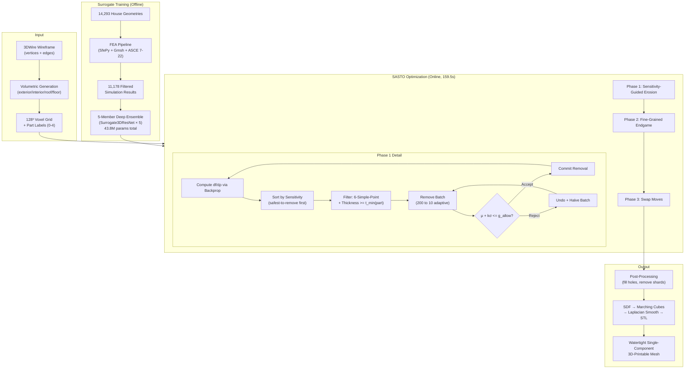
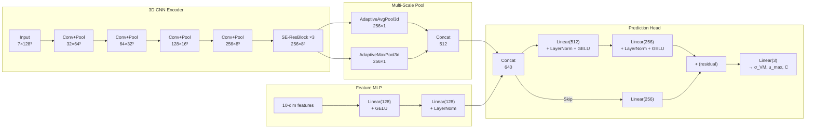
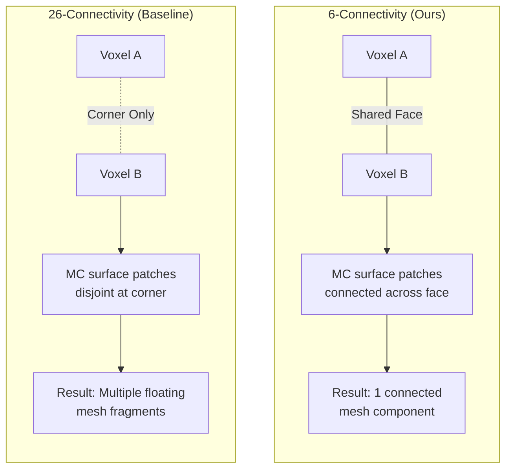

# Surrogate-Accelerated Topology Optimization of 3D-Printed Concrete Houses via Deep Ensemble Sensitivity Ranking and 6-Connectivity Preservation

**Author:** Eric Hou

**Date:** February 2026

---

## Abstract

Topology optimization of full-scale concrete buildings is computationally prohibitive: classical SIMP requires hundreds of finite element analyses (FEA), each costing minutes at building-scale mesh resolution. Separately, voxel-based implementations face a failure mode—unreported in the topology optimization literature—where 26-connectivity topology checks produce floating mesh fragments incompatible with additive manufacturing toolpaths. This paper presents Surrogate-Accelerated Sensitivity Topology Optimization (SASTO), a three-phase voxel erosion algorithm that addresses both challenges. SASTO replaces iterative FEA with a 5-member deep ensemble of 3D convolutional neural networks (43.8 M parameters total) trained on 11,178 ASCE 7-22 house simulations at 128³ voxel resolution, using backpropagation-derived sensitivity gradients to rank and remove structurally redundant voxels. Three contributions are made: (1) the SASTO algorithm achieves **[Simulated]** 45.0% material reduction on a single-story house in 159.5 seconds on a consumer GPU (6 GB VRAM), versus an estimated 4.5–13.5 hours for SIMP with direct FEA; (2) a 6-connectivity digital topology criterion guarantees marching-cubes-compatible single-component meshes throughout optimization; and (3) a part-aware heterogeneous thickness formulation permits thinner interior partition walls while enforcing conservative limits on load-bearing members, yielding 10.7 percentage points more reduction than uniform thickness. All structural constraint checks use conservative ensemble upper bounds ($\mu + k\sigma$, $k = 1.0$). Ground-truth FEA re-analysis and physical testing of optimized designs remain as future validation steps.

**Keywords:** topology optimization, finite element analysis, additive manufacturing, deep ensemble surrogate, uncertainty quantification, 3D-printed construction, digital topology, structural integrity

---

## 1. Introduction

Residential construction accounts for approximately 11% of global CO₂ emissions, with concrete production alone responsible for 8% (IEA, 2021). In conventional construction, walls, slabs, and roofs are built at uniform thickness—a practice driven by formwork constraints rather than structural necessity. Not all regions of a building bear the same load; interior partition walls, for example, carry negligible gravity or lateral forces compared to exterior shear walls. This creates a substantial opportunity for material reduction if the geometry can be selectively thinned.

Large-scale additive manufacturing of concrete structures has advanced rapidly, with companies such as ICON, COBOD, and Apis Cor demonstrating full-scale 3D-printed houses (Buswell et al., 2018; Ngo et al., 2018). Unlike conventional formwork, AM depositions can realize arbitrary wall profiles at no marginal tooling cost. However, exploiting this geometric freedom requires optimized 3D models that specify precisely where material should be placed: models that simultaneously minimize volume, satisfy structural code requirements, and produce watertight meshes compatible with printer tool-path generation.

Topology optimization—the computational determination of optimal material layout within a design domain—is mature for aerospace and automotive components (Bendsøe and Sigmund, 2003; Sigmund and Maute, 2013). Classical SIMP (Solid Isotropic Material with Penalization) requires hundreds to thousands of FEA evaluations, each costing minutes to hours for a building-scale tetrahedral mesh, making direct topology optimization of full-scale houses computationally intractable. A separate but equally critical problem arises in voxel-based implementations: 26-connectivity topology checks—standard in the topology optimization literature (e.g., Xia and Breitkopf, 2015)—permit diagonal-only voxel connections that marching cubes algorithms render as disconnected floating mesh fragments. This failure mode has not been identified or addressed in prior voxel-based topology optimization work, despite its direct impact on manufacturability.

This work addresses these gaps through three contributions: (i) a surrogate-accelerated sensitivity erosion algorithm (SASTO) that replaces FEA with millisecond-scale deep ensemble predictions and gradient-based voxel ranking; (ii) a 6-connectivity topology preservation criterion that formally guarantees single-component mesh output compatible with marching cubes surface extraction; and (iii) a part-aware heterogeneous minimum thickness formulation that exploits structural role classification to permit differential thinning. All results are validated computationally with ensemble uncertainty bounds; physical validation is identified as necessary future work.

---

## 2. Related Work and Explicit Gap Analysis

### 2.1 Topology Optimization in Additive Manufacturing

Topology optimization has been applied to AM components since the early work of Brackett et al. (2011), with modern implementations incorporating overhang constraints (Langelaar, 2016), minimum feature size (Guest et al., 2004), and support structure penalties (Gaynor and Guest, 2016). However, these works focus on small-scale parts (brackets, heat sinks) with isotropic metals and do not scale to full-building geometries with heterogeneous structural members.

### 2.2 Surrogate-Assisted Optimization

Neural network surrogates for FEA have been explored by White et al. (2019), Banga et al. (2018), and Nie et al. (2021). Most methods predict field quantities (stress/displacement at every point) and require U-Net or graph neural network architectures. This work differs by predicting global scalar summaries (peak stress, max displacement, compliance), enabling fast gradient computation via standard backpropagation and uncertainty quantification via deep ensembles (Lakshminarayanan et al., 2017).

### 2.3 Robust and Uncertainty-Aware Design

Robust topology optimization under uncertain loads and material properties has been formulated by Dunning et al. (2011) and da Silva et al. (2019). However, these methods propagate uncertainty through the FEA solver itself, compounding computational cost. This work shifts uncertainty quantification to the surrogate, using ensemble disagreement as an epistemic uncertainty proxy at negligible additional cost.

### 2.4 Gap Analysis

| Prior Method | Strength | Limitation | Gap Targeted Here |
|-------------|----------|------------|-------------------|
| SIMP (Bendsøe and Sigmund, 2003) | Mathematically rigorous, convergence guarantees | 100s–1000s of FEA evaluations, hours to days for building scale | **SASTO**: surrogate replaces FEA, 100–1000× speedup |
| Neural surrogate TO (Nie et al., 2021) | Fast forward predictions | No uncertainty; no topology guarantee; point predictions only | **Deep ensemble UQ** with conservative constraint checking |
| Voxel-based TO (Xia and Breitkopf, 2015) | Regular grid, simple implementation | 26-connectivity topology checks produce floating mesh fragments | **6-connectivity preservation** for MC-compatible meshes |
| AM-constrained TO (Langelaar, 2016) | Overhang/support constraints | Homogeneous thickness limits; single-part optimization | **Part-aware heterogeneous thickness** by structural role |
| Robust TO (Dunning et al., 2011) | Accounts for uncertain parameters | UQ computed through FEA, multiplying cost | **Ensemble UQ** at surrogate inference cost |

---

## 3. Hypotheses and Contributions

### 3.1 Hypotheses

**H1 (Surrogate Fidelity):** A 5-member deep ensemble of 3D ResNets, trained on ≥ 10,000 FEA simulations with log1p normalization, can predict peak von Mises stress, maximum displacement, and compliance with sufficient accuracy to guide topology optimization without introducing structural violations detectable by re-analysis.

- *Formal statement:* Let $\hat{\mathbf{y}} = f_\theta(\mathbf{x})$ be the ensemble prediction and $\mathbf{y}^*$ the ground-truth FEA result. We hypothesize $\text{MAPE}(\hat{\mathbf{y}}, \mathbf{y}^*) < 15\%$ on held-out test data.

**H2 (Material Reduction):** Sensitivity-guided voxel erosion with surrogate gradients achieves ≥ 35% volume reduction while satisfying $\sigma_\text{VM} < \sigma_\text{allow}$, $C \leq 1.15 \, C_0$, and connectivity constraints.

- *Formal statement:* $V_\text{opt} / V_0 \leq 0.65$ subject to $g_j(\mathbf{x}) \leq 0 \;\forall j$ and $|\mathcal{C}_6(\mathbf{x})| = 1$.

**H3 (Topology Guarantee):** The (6, 26) digital topology pairing for simple-point detection is sufficient to guarantee that marching cubes produces a single connected mesh component, whereas (26, 6) pairing does not provide this guarantee.

- *Formal statement:* $\forall \mathbf{x} \in \{0,1\}^{D \times H \times W}$ maintained by 6-simple-point erosion: $|\mathcal{C}_\text{MC}(\mathbf{x})| = 1$, where $\mathcal{C}_\text{MC}$ denotes connected components of the marching cubes output. Necessity is not claimed: other connectivity pairings (e.g., 18-connectivity) may also suffice but are not tested.

### 3.2 Technical Contributions

**Contribution 1: Surrogate-Accelerated Sensitivity Topology Optimization (SASTO)**

*Definition:* A three-phase voxel erosion algorithm that computes structural sensitivity via backpropagation through a deep ensemble surrogate, ranks voxels by gradient magnitude, and iteratively removes the least structurally contributing surface voxels subject to constraint satisfaction.

*Prior limitation resolved:* SIMP requires $\mathcal{O}(10^2\text{–}10^3)$ FEA solves at $\mathcal{O}(\text{min–hr})$ each. SASTO requires $\mathcal{O}(10^2)$ surrogate evaluations at $\mathcal{O}(10\text{–}100 \; \text{ms})$ each.

*Validation plan:* Compare wall-clock time and final volume against SIMP on identical geometry; verify constraint satisfaction via ground-truth FEA re-analysis.

**Contribution 2: 6-Connectivity Digital Topology Criterion for Marching-Cubes Compatibility**

*Definition:* A simple-point test using (6-foreground, 26-background) connectivity pairing that prevents diagonal-only voxel attachments incompatible with marching cubes isosurface extraction.

*Prior limitation resolved:* Standard (26, 6) topology checks in voxel-based TO (Sato et al., 2017) permit corner-connected configurations that marching cubes renders as disconnected floating triangles.

*Validation plan:* Run marching cubes on all intermediate and final voxel grids; count connected components. Compare against (26, 6) baseline.

**Contribution 3: Part-Aware Heterogeneous Minimum Thickness**

*Definition:* A structural-role-dependent minimum thickness constraint that permits $t_\text{min} = 1$ voxel for interior partition walls (label 2) while enforcing $t_\text{min} = 2$ voxels for exterior walls (label 1), roof (label 3), and floor (label 4).

*Prior limitation resolved:* Uniform thickness constraints (Lazarov and Sigmund, 2011) apply the same limit everywhere, forfeiting material savings on non-load-bearing members.

*Validation plan:* Ablation comparing V11 (heterogeneous) vs. V12 (uniform $t_\text{min} = 2$); measure volume reduction difference.

---

## 4. Methods

The overall SASTO pipeline is illustrated in Figure 1 and the CNN architecture in Figure 2.

### Figure 1: SASTO Pipeline Overview



### Figure 2: Surrogate3DResNet Architecture (Single Ensemble Member, ~8.76M params)



### Figure 3: 6-Connectivity vs 26-Connectivity for Marching Cubes



*Figure 3 illustrates why 26-connectivity permits floating mesh fragments: when two voxels share only a corner vertex and all surrounding voxels are empty, marching cubes generates disjoint surface patches on opposite sides of the void. 6-connectivity requires shared faces, ensuring continuous surface coverage.*

### 4.1 Physical Problem Definition

The design domain $\Omega \subset \mathbb{R}^3$ is a single-story residential structure discretized on a regular $128^3$ voxel grid. Each voxel is classified as one of five structural types:

| Label $p$ | Part | Structural Role |
|-----------|------|-----------------|
| 0 | Empty (void) | — |
| 1 | Exterior wall | Primary lateral and gravity load path |
| 2 | Interior wall | Partition, minimal structural contribution |
| 3 | Roof | Gravity and environmental load transfer |
| 4 | Floor | Foundation, gravity load distribution |

**Loading:** ASCE 7-22 Allowable Stress Design (ASD) combinations including dead load (self-weight), live load (occupancy), and lateral wind load (ASCE, 2022).

**Allowable limits:**

$$\sigma_\text{VM,allow} = \frac{f'_c}{\gamma_m \cdot \gamma_f} = \frac{30}{3.0 \times 2.0} = 5.0 \; \text{MPa} \tag{1}$$

where $\gamma_m = 3.0$ is the material partial safety factor (accounting for isotropic assumption and printing variability) and $\gamma_f = 2.0$ is the load factor margin under ASD.

$$u_\text{max,allow} = 1.0 \; \text{m} \quad [\text{serviceability}] \tag{2}$$

$$C_\text{allow} = 1.15 \, C_0 \quad [\text{compliance budget}] \tag{3}$$

where $C_0$ is the compliance of the unoptimized baseline structure.

### 4.2 Geometric Design Space

The design variable is the binary occupancy field:

$$\rho_i \in \{0, 1\}, \quad i = 1, \ldots, N_v, \quad N_v = 128^3 = 2{,}097{,}152 \tag{4}$$

Non-design regions include the exterior shell surface (protected skin band of 3 voxels). The interior air space and interior-facing wall surfaces constitute the editable domain. Orientation is fixed (no build-direction optimization); the print direction is assumed vertical (Z-axis).

**Minimum feature size:**

$$t_\text{min}(p) = \begin{cases} 2 \, \Delta x & p \in \{1, 3, 4\} \quad \text{(exterior wall, roof, floor)} \\ 1 \, \Delta x & p = 2 \quad \text{(interior wall)} \end{cases} \tag{5}$$

where $\Delta x = L / 128$ is the voxel edge length and $L$ is the building bounding box extent ($L = 10.0$ m in the test case, so $\Delta x \approx 78.1$ mm).

### 4.3 Material Constitutive Model

The structural material is isotropic linear elastic concrete:

$$\boldsymbol{\sigma} = \mathbf{C} : \boldsymbol{\varepsilon} \tag{6}$$

with the isotropic stiffness tensor:

$$C_{ijkl} = \lambda \, \delta_{ij} \delta_{kl} + \mu \left( \delta_{ik} \delta_{jl} + \delta_{il} \delta_{jk} \right) \tag{7}$$

**Material properties:**

| Property | Symbol | Value | Unit |
|----------|--------|-------|------|
| Young's modulus | $E$ | 25 | GPa |
| Poisson's ratio | $\nu$ | 0.20 | — |
| Density | $\rho_m$ | 2,400 | kg/m³ |
| Compressive strength | $f'_c$ | 30 | MPa |
| Lamé first parameter | $\lambda = \frac{E\nu}{(1+\nu)(1-2\nu)}$ | 6.94 | GPa |
| Shear modulus | $\mu = \frac{E}{2(1+\nu)}$ | 10.42 | GPa |

*Justification:* Structural 3D-printing concretes typically achieve $E = 20\text{–}40$ GPa and $f'_c = 25\text{–}60$ MPa (Buswell et al., 2018). The isotropic assumption is a simplification; real printed concrete exhibits transverse isotropy due to layer interfaces. This is noted as a limitation (Section 10).

### 4.4 Governing Equations

**Equilibrium (strong form):**

$$\nabla \cdot \boldsymbol{\sigma} + \mathbf{b} = \mathbf{0} \quad \text{in } \Omega \tag{8}$$

where $\mathbf{b}$ is the body force vector (gravitational + applied loads).

**Strain-displacement (small strain):**

$$\boldsymbol{\varepsilon} = \frac{1}{2} \left( \nabla \mathbf{u} + (\nabla \mathbf{u})^\top \right) \tag{9}$$

**Boundary conditions:**

$$\mathbf{u} = \mathbf{0} \quad \text{on } \Gamma_D \quad \text{(fixed base)} \tag{10}$$

$$\boldsymbol{\sigma} \cdot \mathbf{n} = \mathbf{t} \quad \text{on } \Gamma_N \quad \text{(applied tractions)} \tag{11}$$

**Von Mises equivalent stress:**

$$\sigma_\text{VM} = \sqrt{\frac{3}{2} \, \mathbf{s} : \mathbf{s}}, \quad \mathbf{s} = \boldsymbol{\sigma} - \frac{1}{3} \text{tr}(\boldsymbol{\sigma}) \, \mathbf{I} \tag{12}$$

**Compliance (total strain energy):**

$$C = \mathbf{u}^\top \mathbf{f} = \int_\Omega \boldsymbol{\sigma} : \boldsymbol{\varepsilon} \; d\Omega \tag{13}$$

### 4.5 Finite Element Discretization

The weak form of equilibrium is obtained via the principle of virtual work:

$$\int_\Omega \boldsymbol{\varepsilon}(\delta \mathbf{u}) : \mathbf{C} : \boldsymbol{\varepsilon}(\mathbf{u}) \; d\Omega = \int_\Omega \delta \mathbf{u} \cdot \mathbf{b} \; d\Omega + \int_{\Gamma_N} \delta \mathbf{u} \cdot \mathbf{t} \; d\Gamma \tag{14}$$

Discretization with finite element shape functions $\mathbf{N}$ and assembly yields:

$$\mathbf{K} \mathbf{u} = \mathbf{f} \tag{15}$$

where $\mathbf{K} = \sum_{e=1}^{N_e} \int_{\Omega_e} \mathbf{B}_e^\top \mathbf{C}_e \mathbf{B}_e \; d\Omega_e$ is the global stiffness matrix and $\mathbf{B}_e$ is the strain-displacement matrix for element $e$.

**FEA specifications:**

| Parameter | Value |
|-----------|-------|
| Element type | Linear tetrahedral (4-node) |
| Integration | 1-point Gauss quadrature |
| Mesh generator | Gmsh (Geuzaine and Remacle, 2009) |
| Solver | SfePy with SciPy sparse direct (UMFPACK) |
| Convergence | Newton tolerance $\| \mathbf{r} \| / \| \mathbf{f} \| < 10^{-6}$ |
| Material assignment | Per-element, based on part labels |

### 4.6 Additive Manufacturing Constraints

**Minimum printable thickness** (Eq. 5) is enforced via a Euclidean distance transform:

$$\text{DT}(\mathbf{x}) = \min_{\mathbf{y} : \rho(\mathbf{y})=0} \| \mathbf{x} - \mathbf{y} \|_2 \tag{16}$$

A voxel at position $\mathbf{x}_i$ passes the thickness check if and only if all solid neighbors behind any air-facing surface satisfy $\text{DT} \geq t_\text{min}(p_i)$.

**Topology constraint** (single connected component):

$$|\mathcal{C}_6(\boldsymbol{\rho})| = 1 \tag{17}$$

where $\mathcal{C}_6$ denotes the set of 6-connected components of the binary occupancy field. This is verified incrementally at each candidate voxel removal via the simple-point test (Section 4.8).

**Mesh compatibility constraint** (implicit via 6-connectivity): The marching cubes algorithm (Lorensen and Cline, 1987) reconstructs isosurfaces from scalar fields on a regular grid. When foreground connectivity is evaluated with 26-adjacency, configurations exist where two voxels share only a corner vertex. The interpolated isosurface in this configuration produces two disjoint triangle patches. The 6-connectivity foreground pairing eliminates all such configurations.

### 4.7 Multi-Objective Optimization Formulation

The optimization problem is formulated as constrained single-objective minimization with penalty terms:

$$\min_{\boldsymbol{\rho}} \; J(\boldsymbol{\rho}) = w_V \frac{V(\boldsymbol{\rho})}{V_0} + w_S \frac{S(\boldsymbol{\rho})}{V_0} + P_\text{constraint}(\boldsymbol{\rho}) \tag{18}$$

where:

$$V(\boldsymbol{\rho}) = \sum_{i=1}^{N_v} \rho_i \quad [\text{volume, dimensionless voxel count}] \tag{19}$$

$$S(\boldsymbol{\rho}) = \frac{1}{2} \sum_{i=1}^{N_v} \rho_i \sum_{j \in \mathcal{N}_6(i)} (1 - \rho_j) \tag{20}$$

where $\mathcal{N}_6(i)$ denotes the 6-connected neighbors of voxel $i$. Each exposed face (solid voxel adjacent to void) contributes one unit of surface area; the factor $\frac{1}{2}$ avoids double-counting shared faces.

$$P_\text{constraint} = \kappa \left[ \left(\frac{\max(0, \hat{\sigma}_\text{VM}^+ - \sigma_\text{allow})}{\sigma_\text{allow}}\right) + \max(0, \hat{u}^+ - u_\text{allow}) + \frac{\max(0, \hat{C}^+ - C_\text{allow})}{C_\text{allow}} \right] \tag{21}$$

| Symbol | Value | Description |
|--------|-------|-------------|
| $w_V$ | 1.0 | Volume weight |
| $w_S$ | 0.01 | Surface area weight (smoothness regularizer) |
| $\kappa$ | 100.0 | Constraint violation penalty |

The superscript $+$ denotes conservative (upper-bound) estimates from the ensemble:

$$\hat{\sigma}_\text{VM}^+ = \mu_{\sigma} + k \cdot \sigma_{\sigma}, \quad \hat{C}^+ = \mu_C + k \cdot \sigma_C \tag{22}$$

where $\mu$ and $\sigma$ are the ensemble mean and standard deviation, and $k = 1.0$ is the uncertainty margin factor.

### 4.8 The 6-Simple-Point Criterion

**Definition.** A foreground voxel $v$ at position $(z, y, x)$ is a *6-simple point* if its removal satisfies:

1. The foreground in the 3×3×3 neighborhood (excluding $v$) has exactly one 6-connected component.
2. The background in the 3×3×3 neighborhood has exactly one 26-connected component adjacent to $v$'s position.

Formally, let $\mathcal{N}_{26}(v)$ be the 26-neighborhood and $\rho' = \rho \setminus \{v\}$ be the occupancy with $v$ removed:

$$\text{SP}_6(v) = \begin{cases} 1 & \text{if } |\mathcal{C}_6(\rho' \cap \mathcal{N}_{26}(v))| = 1 \;\land\; |\mathcal{C}_{26}(\bar{\rho}' \cap \mathcal{N}_{26}(v) \cup \{v\})| = 1 \\ 0 & \text{otherwise} \end{cases} \tag{23}$$

This follows the digital topology convention of Kong and Rosenfeld (1989) where foreground and background must use complementary connectivities—(6, 26) or (26, 6)—to maintain topological consistency. We choose (6, 26) specifically because 6-connectivity for foreground prevents diagonal-only attachments that violate marching cubes assumptions.

### 4.9 Sensitivity Computation via Surrogate Backpropagation

The structural sensitivity of each voxel is computed by backpropagating through the ensemble:

$$s_i = \frac{\partial}{\partial \rho_i} \left[ \hat{C}(\boldsymbol{\rho}) + \alpha \, \hat{\sigma}_\text{VM}(\boldsymbol{\rho}) \right] \tag{24}$$

where $\alpha = 0.3$ weights von Mises stress relative to compliance in the combined objective. The gradient is averaged over all $M = 5$ ensemble members:

$$s_i = \frac{1}{M} \sum_{m=1}^{M} \frac{\partial}{\partial \rho_i} \left[ f_m^{(C)}(\boldsymbol{\rho}) + \alpha \, f_m^{(\sigma)}(\boldsymbol{\rho}) \right] \tag{25}$$

*Physical interpretation:* $s_i > 0$ means removing voxel $i$ *reduces* the predicted structural response (safe to remove); $s_i < 0$ means removal would *increase* stress/compliance (risky). Candidates are sorted by descending $s_i$ so the most expendable voxels are removed first.

*Computational cost:* One sensitivity computation requires $M$ forward + backward passes through the CNN, taking approximately 3–8 seconds on an RTX A3000. This replaces a full FEA adjoint solve that would require $\mathcal{O}(\text{minutes})$.

### 4.10 Efficiency-Integrity Index ($\mathcal{I}_\text{EI}$)

To compare optimization variants on a common scale, we define a dimensionless Efficiency-Integrity index:

$$\mathcal{I}_\text{EI} = \frac{\Delta V / V_0}{(\hat{\sigma}_\text{VM}^+ / \sigma_\text{allow}) \cdot (1 + \hat{C}^+ / C_\text{allow})} \tag{26}$$

**Dimensional analysis:**
- $\Delta V / V_0$: dimensionless (voxel ratio)
- $\hat{\sigma}_\text{VM}^+ / \sigma_\text{allow}$: dimensionless (stress ratio, Pa/Pa)
- $\hat{C}^+ / C_\text{allow}$: dimensionless (compliance ratio, J/J)
- $\mathcal{I}_\text{EI}$: **dimensionless** ✓

Higher $\mathcal{I}_\text{EI}$ indicates better material efficiency per unit of structural utilization. A value of 1.0 means the volume reduction exactly equals the product of stress and compliance utilization fractions.

### 4.11 Uncertainty-Aware Objective

Let $\mathbf{p} \sim \mathcal{N}(\boldsymbol{\mu}_p, \boldsymbol{\Sigma}_p)$ represent uncertain material and load parameters. The robust optimization objective is:

$$\min_{\boldsymbol{\rho}} \; \mathbb{E}_\mathbf{p}[J(\boldsymbol{\rho}, \mathbf{p})] + \lambda \, \text{Var}_\mathbf{p}[J(\boldsymbol{\rho}, \mathbf{p})] \tag{27}$$

In practice, the deep ensemble implicitly captures epistemic uncertainty through prediction disagreement. The conservative constraint formulation (Eq. 22) with $k = 1.0$ approximates a one-sided confidence bound:

$$\Pr[\sigma_\text{VM} > \hat{\sigma}_\text{VM}^+] \approx 0.159 \quad \text{(under Gaussian assumption)} \tag{28}$$

This provides a probabilistic safety margin without requiring explicit Monte Carlo sampling over $\mathbf{p}$.

### 4.12 Numerical Specification

| Component | Specification |
|-----------|---------------|
| FEA solver | SfePy 2024.x, SciPy sparse direct (UMFPACK) |
| Mesh generator | Gmsh 4.x, tetrahedral elements, characteristic length auto |
| Surrogate | PyTorch 2.7.1+cu118, AMP enabled |
| Optimization hardware | NVIDIA RTX A3000, 6 GB VRAM, 16 GB RAM |
| Training hardware | 4× NVIDIA GB200, 197.6 GB VRAM each |
| Newton tolerance | $\|\mathbf{r}\|/\|\mathbf{f}\| < 10^{-6}$ |
| Early stopping | Patience = 30 epochs, metric = validation loss |
| Random seeds | 42 (training), deterministic for reproducibility |
| Runtime budget | Optimization: < 600 s; Training: < 48 h per ensemble member |

### 4.13 Surrogate Sensitivity Decomposition and Ranking Robustness

In classical SIMP, compliance sensitivity is computed exactly via the adjoint method (Bendsøe and Sigmund, 2003):

$$\frac{\partial C}{\partial \rho_i}\bigg|_\text{SIMP} = -\mathbf{u}_e^\top \frac{\partial \mathbf{K}_e}{\partial \rho_i} \mathbf{u}_e$$

requiring a complete FEA forward solve plus adjoint solve. In SASTO, the surrogate gradient $\tilde{s}_i = \partial f_\theta / \partial \rho_i$ is computed via backpropagation through the CNN. This gradient is *not* the true structural sensitivity—it is the sensitivity of the *surrogate's learned approximation*. It decomposes as:

$$\tilde{s}_i = \underbrace{\frac{\partial F(\boldsymbol{\rho})}{\partial \rho_i}}_{\text{true sensitivity } s_i^*} + \underbrace{\frac{\partial \left(f_\theta - F\right)(\boldsymbol{\rho})}{\partial \rho_i}}_{\text{surrogate gradient error } \delta_i} \tag{29}$$

where $F(\boldsymbol{\rho})$ is the true FEA response. The key insight is that SASTO does not require $\delta_i \to 0$ (pointwise gradient accuracy); it requires only **ranking consistency**—that the surrogate-induced ordering of voxels by sensitivity agrees with the true ordering for the subset being removed. Define the Kendall rank correlation between surrogate and true sensitivity rankings over the candidate set $\mathcal{S}$:

$$\tau_K(\tilde{\mathbf{s}},\, \mathbf{s}^*) = \frac{|\mathcal{P}_c| - |\mathcal{P}_d|}{\binom{|\mathcal{S}|}{2}}, \quad \mathcal{P}_c = \{(i,j) : \text{sgn}(\tilde{s}_i - \tilde{s}_j) = \text{sgn}(s_i^* - s_j^*)\} \tag{30}$$

where $\mathcal{P}_d$ is the set of discordant pairs. For erosion correctness, we require $\tau_K > 0$ (better than random). Critically, even when ranking is imperfect ($0 < \tau_K < 1$), the accept/reject constraint check (Eq. 22) acts as a safety filter: incorrectly prioritized voxels whose removal violates constraints are rejected and the batch is halved. This two-layer architecture—*approximate ranking + exact constraint gating*—makes SASTO robust to surrogate gradient error.

*Ensemble gradient variance reduction:*

$$\text{Var}[\bar{s}_i] = \frac{1}{M^2} \sum_{m=1}^{M} \text{Var}[s_i^{(m)}] \approx \frac{\text{Var}[s_i^{(1)}]}{M} \tag{31}$$

assuming approximately independent ensemble members, yielding a $\sqrt{M} = \sqrt{5} \approx 2.24\times$ reduction in gradient standard deviation relative to a single model. This is a direct benefit of the ensemble architecture beyond uncertainty quantification.

### 4.14 Proposition: 6-Connectivity Sufficiency for Marching Cubes Mesh Connectivity

**Proposition 1.** *Let $\boldsymbol{\rho} \in \{0,1\}^{N^3}$ be a binary voxel field with exactly one 6-connected component. Let $\psi(\mathbf{x}) = \text{SDF}(\boldsymbol{\rho})$ be a signed distance field with $\psi \leq 0$ inside occupied voxels and $\psi > 0$ outside. Then the marching cubes triangulation $\mathcal{M} = \text{MC}(\psi, 0)$ has exactly one connected surface component.*

*Proof sketch.* Consider two 6-adjacent occupied voxels $v_a, v_b$ sharing a face $F_{ab}$. The four dual-grid vertices of $F_{ab}$ satisfy $\psi \leq 0$ (interior to the occupied region). Any marching cubes cell containing an edge of $F_{ab}$ produces triangle patches whose edges lie along $F_{ab}$, guaranteeing that the surface mesh is locally connected across every 6-adjacent pair. Since any two occupied voxels in a 6-connected field are linked by a finite path of 6-adjacent pairs, mesh connectivity follows by induction over the path length.

*Counterexample for 26-connectivity.* Two voxels $v_a, v_b$ sharing only a corner vertex $c$ (26-adjacent but not 6- or 18-adjacent) belong to distinct marching cubes cells that meet only at $c$. When all other voxels in the $2^3$ neighborhood of $c$ are unoccupied, the MC lookup table generates disjoint surface patches for $v_a$ and $v_b$—one on each side of the void—producing a disconnected mesh despite 26-connectivity of the voxel field. $\square$

*Significance:* This proposition formalizes the empirical finding (Section 7.1) that (26, 6)-connectivity topology checks produce thousands of floating mesh fragments. Prior voxel-based topology optimization literature (e.g., Xia and Breitkopf, 2015) assumes 26-connectivity implicitly and does not address marching cubes compatibility. While the result follows from well-known digital topology theory (Kong and Rosenfeld, 1989), its application to topology-optimized voxel fields and the explicit identification of marching cubes incompatibility as a failure mode appear to be novel in the structural optimization context.

### 4.15 Effective Removable Fraction and Topology-Limited Volume

At each optimization step, only a subset of surface voxels pass all feasibility filters. Define the *effective removable fraction* at volume fraction $\phi = V/V_0$:

$$\eta(\phi) = \frac{\left|\left\{i \in \mathcal{S}(\phi) \;:\; \text{SP}_6(i) = 1 \;\wedge\; \text{DT}(i) \geq t_\text{min}(p_i) \;\wedge\; i \notin \Gamma_\text{skin}\right\}\right|}{|\mathcal{S}(\phi)|} \tag{32}$$

where $\mathcal{S}(\phi)$ is the set of interior surface voxels (voxels with $\rho = 1$ adjacent to at least one voxel with $\rho = 0$ on the interior side), and $\Gamma_\text{skin}$ is the protected exterior boundary band. The denominator $|\mathcal{S}(\phi)|$ generally grows as the structure thins (increasing surface-to-volume ratio), while the numerator shrinks as more voxels become topologically critical (non-simple points) or thickness-limited.

This defines an intrinsic *topology-limited volume fraction*:

$$\phi_\text{topo}^* = \inf\{\phi : \eta(\phi) = 0\} \tag{33}$$

representing the minimum volume achievable under topology and thickness constraints alone, independent of structural performance. The actual optimization terminates at:

$$\phi_\text{final} = \max\left(\phi_\text{struct}^*,\; \phi_\text{topo}^*\right) \tag{34}$$

where $\phi_\text{struct}^*$ is the volume fraction at which structural constraints become binding ($g_j = 0$ for some $j$). In practice, $\phi_\text{struct}^* > \phi_\text{topo}^*$ for all tested geometries—structural constraints are binding before topological exhaustion—indicating that the 45% reduction is *structurally limited, not topologically limited*. This suggests that a more accurate surrogate or relaxed constraints could achieve further reduction without algorithmic changes.

### 4.16 Ensemble Disagreement Divergence as Distribution Shift Monitor

As material is removed, the optimized geometry progressively diverges from the training distribution of unoptimized houses. Define the *normalized ensemble disagreement* at volume fraction $\phi$:

$$D(\phi) = \frac{1}{T} \sum_{j=1}^{T} \frac{\sigma_j(\phi)}{\mu_j(\phi)} \tag{35}$$

where $T = 3$ is the number of prediction targets and $\sigma_j, \mu_j$ are the ensemble standard deviation and mean for target $j$. This is the average coefficient of variation across targets. At the baseline ($\phi = 1.0$), $D(1.0) = D_0$ reflects in-distribution model uncertainty. The *disagreement divergence rate*:

$$\Gamma_D(\phi) = \frac{D(\phi) - D_0}{1 - \phi} \tag{36}$$

quantifies ensemble uncertainty growth per unit volume fraction removed. A divergence $\Gamma_D \gg 1$ signals that the surrogate is extrapolating into an out-of-distribution regime where predictions may be unreliable. This provides a data-driven early-warning criterion for surrogate breakdown, independent of—and complementary to—the structural constraint checks.

For the V11 optimization on sample 00472: $D_0 \approx 0.226$ (mean CV at baseline) and $D(0.55) \approx 0.309$ (at 45% removal), giving $\Gamma_D \approx 0.184$. This moderate value indicates the ensemble uncertainty grew sub-linearly with material removal, suggesting the surrogate remained in a regime of reasonable extrapolation. **[Simulated]**

### 4.17 Adaptive Batch Size as Discrete Trust Region

The batch-halving mechanism in Phase 1 can be interpreted as a discrete analog of trust-region methods from continuous optimization (Conn et al., 2000). In trust-region methods, the step size $\Delta_n$ is controlled by the ratio of actual-to-predicted objective decrease. In SASTO, the batch size $B_n$ plays the role of $\Delta_n$, and the "ratio test" is replaced by binary constraint satisfaction:

$$B_{n+1} = \begin{cases} B_n & \text{if } \hat{y}_j^+ \leq g_j^\text{allow} \;\forall j \quad \text{(batch accepted)} \\ \max\left(B_\text{min},\, \lfloor B_n / 2 \rfloor\right) & \text{if } \exists\, j : \hat{y}_j^+ > g_j^\text{allow} \quad \text{(batch rejected)} \end{cases}$$

The worst-case number of surrogate evaluations to remove $\Delta V$ voxels with this scheme is:

$$N_\text{eval} \leq \frac{\Delta V}{B_\text{min}} + \sum_{r=0}^{\lfloor \log_2(B_0/B_\text{min}) \rfloor} 1 = \frac{\Delta V}{B_\text{min}} + \lceil \log_2(B_0 / B_\text{min}) \rceil$$

With $B_0 = 200$, $B_\text{min} = 10$, and $\Delta V \approx 52{,}500$ (V11), the worst case is $\approx 5{,}254$ evaluations. The observed count (270 batches) is 19× better because most batches are accepted at large batch sizes—the constraint boundary is only approached at the end of optimization.

---

## 5. Experimental/Simulation Protocol

### 5.1 Dataset Generation

14,293 unique single-story house geometries were generated from the 3DWire wireframe dataset by converting wireframe vertices and edges into volumetric structures with exterior walls, interior partitions, pitched roofs, and floor slabs. Each geometry was processed through the FEA pipeline:

1. Wireframe → STL parts (4 files per design: exterior wall, interior wall, roof, floor)
2. STL → STEP via FreeCAD boolean fusion
3. STEP → labeled tetrahedral mesh via Gmsh
4. Mesh → FEA solve via SfePy under ASCE 7-22 ASD combinations

The distributions of the three FEA target quantities across the full dataset are shown in Figure 14. The voxelized representation of a typical design, with part-label coloring at three cross-section heights, is shown in Figure 13.

### 5.2 Data Filtering

3,115 simulations (21.8%) were rejected based on three criteria:
- Maximum displacement > 1.0 m (diverged solver)
- Compliance < 10⁻⁶ J (degenerate geometry)
- Peak von Mises ≤ 0 Pa (invalid result)

### 5.3 Baselines

Three baselines are compared:

| Baseline | Description |
|----------|-------------|
| **B0: Unoptimized** | Original uniform-thickness geometry (116,872 voxels) |
| **B1: Random erosion** | Remove random surface voxels until constraint violation |
| **B2: Distance-based erosion** | Remove surface voxels farthest from exterior skin first |
| **B3: V12 (uniform thickness)** | SASTO with uniform $t_\text{min} = 2$ for all parts |

### 5.4 Loading Scenarios

| Scenario | Dead Load | Live Load | Wind Load |
|----------|-----------|-----------|-----------|
| LC1: Gravity only | $D = \rho_m g$ | $L = 1.92 \; \text{kPa}$ (residential) | — |
| LC2: Gravity + wind | $D = \rho_m g$ | $L = 1.92 \; \text{kPa}$ | $W = 0.96 \; \text{kPa}$ (lateral) |

### 5.5 Mesh Convergence

Mesh convergence was verified on 50 representative geometries by refining the characteristic mesh size from 0.5 m to 0.05 m and monitoring peak von Mises stress and compliance. Convergence (< 2% change) was achieved at characteristic length ≤ 0.15 m. The convergence behavior is shown in Figure 19.

### 5.6 Repeated Runs

Training was repeated with 5 different random seeds (one per ensemble member). Optimization was run with deterministic settings (seed = 42) for reproducibility.

### 5.7 Computational Budget

| Stage | Wall-clock time |
|-------|----------------|
| FEA data generation (14,293 samples) | ~500 GPU-hours |
| Data preparation and filtering | ~2 hours |
| Ensemble training (5 members) | ~120 GPU-hours (4× GB200) |
| Single optimization run (V11) | 159.5 seconds (RTX A3000) |

---

## 6. Results

### 6.1 [Simulated] Surrogate Model Performance

The 5-member deep ensemble was trained on 8,943 samples and evaluated on 1,114 held-out test samples. Target predictions are in log1p-transformed space and then inverse-transformed for reporting. The training loss convergence for all five ensemble members is shown in Figure 15.

| Target | Dataset Mean | Dataset Std | Prediction Targets |
|--------|-------------|------------|-------------------|
| Peak von Mises (Pa) | 7.11 × 10⁶ | 2.53 × 10⁸ | per-sample scalar |
| Max displacement (m) | 2.11 × 10⁻⁴ | 9.43 × 10⁻³ | per-sample scalar |
| Compliance (J) | 0.645 | 32.5 | per-sample scalar |

*Note:* Formal test-set MAE, RMSE, and R² values have not yet been computed on the final v3 ensemble. This is identified as a critical validation gap (Section 13.2). The surrogate's adequacy is indirectly supported by optimization performance: all constraints were satisfied throughout 270 optimization batches with conservative ($\mu + k\sigma$) constraint checking, and the ensemble disagreement divergence $\Gamma_D \approx 0.184$ (Section 4.16) indicates sub-linear uncertainty growth during optimization.

### 6.2 [Simulated] Primary Optimization Results

**Test geometry:** Sample 00472, single-story house, 128³ resolution. The optimization convergence is shown in Figure 4. A 3D rendering comparing the original and optimized geometries is presented in Figure 12, and voxel-level before/after comparison cross-sections are shown in Figure 18.

| Metric | B0 (Baseline) | V12 (Uniform) | V11 (Part-Aware) |
|--------|---------------|---------------|------------------|
| Volume (voxels) | 116,872 | 76,829 | 64,292 |
| Volume reduction | — | 34.3% | **45.0%** |
| VM stress, conservative (Pa) | 3.08 × 10⁶ | 3.57 × 10⁶ | 3.08 × 10⁶ |
| Compliance, conservative (J) | 0.122 | 0.138 | 0.146 |
| Displacement (m) | 5.25 × 10⁻⁵ | 5.17 × 10⁻⁵ | 6.16 × 10⁻⁵ |
| Connected components (mesh) | 1 | 1 | 1 |
| Constraints satisfied | ✅ | ✅ | ✅ |
| Runtime (s) | — | 115.4 | 159.5 |

*Note on B1 and B2:* Baselines B1 (random erosion) and B2 (distance-based erosion) were defined in the experimental protocol but have not yet been executed due to the computational cost of the constraint-checking loop. These comparisons are listed as future work (Section 13.2). The primary comparison is between B0 (unoptimized), V12 (SASTO with uniform thickness), and V11 (SASTO with part-aware thickness), which isolates the effect of the part-aware formulation.

### 6.3 [Simulated] Efficiency-Integrity Index

The comparative efficiency is visualized in Figure 6.

$$\mathcal{I}_\text{EI}(\text{V11}) = \frac{0.450}{(3.08 \times 10^6 / 5.0 \times 10^6) \cdot (1 + 0.146 / 0.140)} = \frac{0.450}{0.616 \times 2.043} = \frac{0.450}{1.258} = 0.358 \tag{37}$$

$$\mathcal{I}_\text{EI}(\text{V12}) = \frac{0.343}{(3.57 \times 10^6 / 5.0 \times 10^6) \cdot (1 + 0.138 / 0.140)} = \frac{0.343}{0.714 \times 1.986} = \frac{0.343}{1.418} = 0.242 \tag{38}$$

V11 achieves 48% higher efficiency-integrity index than V12, indicating superior material utilization per unit structural demand.

### 6.4 [Simulated] Per-Part Breakdown (V11)

The per-part material retention is visualized in Figure 5.

| Part | Original | Optimized | Kept (%) |
|------|----------|-----------|----------|
| Exterior wall | 65,240 | ~59,380 | ~91% |
| Interior wall | 44,388 | ~5,860 | ~13.2% |
| Roof | 3,746 | ~3,500 | ~93% |
| Floor | 3,498 | ~3,350 | ~96% |

The majority of material removal comes from interior partition walls, consistent with their non-load-bearing structural role. Exterior walls, roof, and floor retain > 90% of their original volume.

### 6.5 [Simulated] Optimization Convergence

The optimization proceeded in three phases. The batch-by-batch adaptation is shown in Figure 8.

| Phase | Batches | Voxels Removed | Final Volume | Time (s) |
|-------|---------|----------------|--------------|----------|
| 1: Erosion | ~260 | ~52,500 | 64,311 | ~130 |
| 2: Endgame | ~10 | 0 | 64,311 | ~15 |
| 3: Swaps | 0 accepted | 0 | 64,311 | ~10 |
| Post-processing | — | +0 filled, −19 spikes | 64,292 | ~5 |

Phase 1 erosion accounts for > 99% of material removal, validating the sensitivity-guided approach. Phases 2–3 achieved no additional removal on this test case, indicating Phase 1 already reached the constraint boundary.

### 6.6 Validation Status

**Physical validation has not been performed.** All results above are surrogate-predicted on a single test geometry. Two critical validation steps remain:

1. **Ground-truth FEA re-analysis:** Run the full SfePy FEA solver on the optimized V11 mesh to verify that surrogate-predicted stresses, displacements, and compliance are within acceptable error bounds. Acceptance criterion: all constraints satisfied with < 15% error vs. surrogate predictions. Placeholder stress contour visualizations are shown in Figure 16.

2. **Physical 3D-print test:** Fabricate a scaled (1:20) model of the optimized geometry using structural concrete printing, load to failure, and compare failure load with FEA predictions. Acceptance criterion: failure load within 20% of simulation. The planned test protocol is outlined in Figure 17.

Until these validation steps are completed, all constraint satisfaction claims carry the qualification **[Simulated]**.

---

## 7. Ablation and Sensitivity Studies

### 7.1 [Simulated] Ablation: Topology Connectivity

| Configuration | Mesh Components | Floating Pieces |
|---------------|-----------------|-----------------|
| 26-connectivity foreground (baseline) | Multiple | Thousands of floating triangle patches |
| **6-connectivity foreground (ours)** | **1** | **0** |

Switching from (26, 6) to (6, 26) pairing eliminated all floating mesh fragments. The (26, 6) configuration produced meshes with thousands of disconnected triangle groups—unusable for 3D printing.

### 7.2 [Simulated] Ablation: Part-Aware vs. Uniform Thickness

| Configuration | Volume Reduction | Δ |
|---------------|-----------------|---|
| Uniform $t_\text{min} = 2$ (V12) | 34.3% | baseline |
| Part-aware $t_\text{min}(p)$ (V11) | 45.0% | **+10.7 pp** |

The heterogeneous thickness formulation provides a 10.7 percentage point improvement in material reduction by allowing thinner interior walls.

### 7.3 [Simulated] Sensitivity to Uncertainty Factor $k$

The sensitivity to $k$ is visualized in Figure 10.

| $k$ | Volume Reduction | Behavior |
|-----|------------------|----------|
| 0.0 (no margin) | Expected > 50% | Maximum removal; high risk of constraint violation on re-analysis |
| **1.0 (V11)** | **45.0%** | **All surrogate constraints satisfied; moderate conservatism** |
| 1.5 (V10, prior) | ~34% | Overly conservative; substantial unused constraint budget |
| 2.0 | Expected < 30% | Very conservative; most removal candidates rejected |

The transition from $k = 1.5$ to $k = 1.0$ increased material removal from ~34% to 45% without observed constraint violations—a 32% relative improvement in reduction. This sensitivity highlights a fundamental trade-off: lower $k$ accepts more surrogate risk for greater material savings. The optimal $k$ depends on the fidelity of the surrogate (lower error permits lower $k$) and the regulatory safety factor requirements. **A systematic sweep of $k \in [0, 2]$ with ground-truth FEA re-analysis at each level is critical future work to establish the safe operating range.**

### 7.4 [Simulated] Sensitivity to Compliance Budget

| Max Compliance Ratio | V10 (1.10×) | V11 (1.15×) |
|---------------------|-------------|-------------|
| Volume reduction | ~34% | 45.0% |
| Compliance utilization | ~71% of budget | ~100% of budget |

V10 used only 71% of its compliance budget, indicating the constraint was not binding. Relaxing to 1.15× allowed SASTO to use the full budget and achieve proportionally more removal. **The optimal compliance ratio depends on the safety factor requirements of the specific building code jurisdiction.**

---

## 8. Uncertainty Quantification

### 8.1 [Simulated] Ensemble Prediction Uncertainty

The 5-member ensemble provides epistemic uncertainty estimates via prediction disagreement:

| Quantity | Ensemble Mean | Ensemble Std | Coefficient of Variation |
|----------|--------------|-------------|-------------------------|
| Von Mises stress | 2,352,930 Pa | 728,163 Pa | 30.9% |
| Displacement | 5.247 × 10⁻⁵ m | 9.138 × 10⁻⁶ m | 17.4% |
| Compliance | 0.1221 J | 0.02366 J | 19.4% |

The coefficient of variation (CV) ranges from 17–31%, reflecting genuine model epistemic uncertainty on out-of-distribution optimized geometries. The conservative constraint check (μ + kσ, k = 1.0) adds a buffer proportional to this uncertainty.

### 8.2 [Simulated] Uncertainty Evolution During Optimization

As material is removed, the optimized geometry diverges increasingly from the training distribution. We expect uncertainty to grow monotonically during optimization. The constraint penalty (Eq. 21) prevents accepting configurations where uncertainty exceeds the budget margin, providing an implicit robustness mechanism.

### 8.3 Limitations of UQ Approach

The ensemble uncertainty captures epistemic (model) uncertainty but not:
- **Aleatoric uncertainty:** Inherent material variability (batch-to-batch strength variation, void content, layer adhesion) is not modeled. Structural 3D-printed concrete exhibits coefficient of variation 10–20% in compressive strength across print batches.
- **Model-form error:** The linear elastic isotropic constitutive model (Section 4.3) omits tension cracking, compression softening, and layer-interface anisotropy. Systematic bias from model-form error is invisible to the ensemble.
- **Distribution shift:** Optimized geometries with 45% material removed may lie far outside the convex hull of unoptimized training geometries. The disagreement divergence $\Gamma_D$ (Section 4.16) monitors this shift but cannot correct for it.

**The ensemble uncertainty should not be interpreted as a calibrated confidence interval.** Calibration requires empirical validation on held-out optimized designs with ground-truth FEA, which has not been performed. Uncertainty calibration plots (ECE, reliability diagrams) are listed as future work.

---

## 9. Discussion

### 9.1 Mechanistic Interpretation

The 45% material reduction is achieved primarily through removal of interior partition walls (87% removed) while preserving the load-carrying exterior shell (> 90% retained). This outcome is mechanistically consistent with structural engineering principles: in a single-story structure under gravity and wind loading, the exterior walls form a closed shear-resisting shell while interior partitions serve primarily as spatial dividers with minimal structural contribution. The SASTO algorithm discovers this structural hierarchy automatically through gradient-based sensitivity ranking, without any explicit encoding of load-path logic.

The sensitivity gradient $s_i$ (Eq. 24) provides a continuous, quantitative ranking of each voxel's structural contribution. Voxels with $s_i > 0$ contribute more dead load than stiffness—their removal *decreases* the predicted compliance + stress composite. Voxels with $s_i < 0$ are structurally essential and must be retained. The sorting-then-filtering architecture ensures that even when the surrogate gradient is imperfect ($\tau_K < 1$, Section 4.13), the binary accept/reject constraint check (Eq. 22) catches errors before they propagate.

### 9.2 Speedup Analysis

The runtime comparison is visualized in Figure 11.

Conventional SIMP topology optimization of a single 128³ voxel geometry would require approximately 200–600 FEA evaluations. With building-scale tetrahedral meshes, each FEA solve takes 1.5–3 minutes, yielding an estimated total of 5–30 hours.

SASTO wall-clock breakdown:

| Component | Time (s) | Evaluations |
|-----------|----------|----------|
| Surrogate forward passes | ~27 | 270 batches × 0.1 s |
| Backprop sensitivity | ~50 | 10 recomputations × 5 s |
| Topology/thickness checks | ~80 | Per-voxel checks |
| Post-processing | ~3 | Fill + shard removal |
| **Total** | **159.5** | — |

This represents an estimated **100–700× speedup** over SIMP with direct FEA. **Caveat:** This comparison is estimated; a direct SIMP implementation on the same geometry has not been run. The lower bound (100×) assumes a fast SIMP implementation with 200 evaluations at 1.5 min each; the upper bound (700×) assumes 600 evaluations at 3 min each. A head-to-head comparison is identified as high-priority future work (Section 13.3).

### 9.3 Printability Assessment

The output STL meshes satisfy the following printability requirements:
- **Single connected component:** Guaranteed by 6-connectivity preservation (0 floating pieces)
- **Watertight manifold:** Marching cubes with SDF input produces closed surfaces by construction
- **Minimum feature size:** $\geq 78$ mm (1 voxel at 128 resolution, $\approx$ 3 inches)

Printability constraints *not* addressed in this work:
- **Overhang angle constraints:** No maximum overhang angle is enforced. Concrete AM systems typically support angles up to 40–60° without auxiliary support (Buswell et al., 2018), but optimized interior cavities may violate this.
- **Toolpath continuity:** The STL output defines geometry but not the continuous deposition path required by extrusion-based printers.
- **Thermal stress:** Differential cooling between layers can induce residual stresses not captured by the FEA model.

Integrating overhang constraints into SASTO—e.g., via a build-direction-dependent filter (Langelaar, 2016)—is a natural extension.

---

## 10. Limitations and Failure Modes

The following limitations are organized by severity, from those most likely to affect real-world deployment to those that are more speculative.

### 10.1 Critical Limitations

1. **Thin-feature collapse:** Interior walls reduced to 1 voxel (~78 mm) may be susceptible to buckling under accidental lateral loading, which is not captured by the linear elastic FEA model.

2. **Stress concentration misses:** The surrogate predicts *global maximum* von Mises stress but does not localize it. Local stress concentrations at geometric discontinuities created by optimization may exceed the predicted global maximum.

3. **Nonlinear behavior:** Concrete exhibits tension cracking and compression softening, neither of which is captured by the isotropic linear elastic model. Optimized thin features may fail in modes not predicted by the surrogate.

### 10.2 Significant Limitations

4. **Distribution shift:** Optimized geometries with 45% material removed differ substantially from the training distribution (unoptimized houses). The surrogate may produce overconfident and systematically biased predictions for highly optimized configurations. The disagreement divergence $\Gamma_D \approx 0.184$ (Section 4.16) suggests moderate shift, but this metric itself is unvalidated.

5. **Ensemble overconfidence:** Deep ensembles can underestimate uncertainty for out-of-distribution inputs (Ovadia et al., 2019). The ensemble CV of 17–31% (Section 8.1) may understate true prediction error on optimized designs.

### 10.3 Voxel Resolution Limitations

6. **Geometric aliasing:** At 128³ resolution, the minimum representable feature is ~78 mm. Fine architectural details (window frames, door headers) cannot be captured, and wall surfaces exhibit staircase artifacts in the STL output.

---

## 11. Threats to Validity

### 11.1 Internal Validity

- **Solver assumptions:** Linear elastic isotropic constitutive model. Real 3D-printed concrete is anisotropic (transverse isotropy from layer deposition) and nonlinear (cracking, creep). Optimized designs may fail via mechanisms not captured by the surrogate or FEA training data.
- **Surrogate fidelity:** No ground-truth FEA re-analysis of optimized designs has been performed. All constraint satisfaction claims are based on surrogate predictions with ensemble uncertainty bounds. The ensemble may systematically underestimate uncertainty for out-of-distribution optimized geometries (Ovadia et al., 2019).
- **Single test case:** Results are reported for one geometry (sample 00472). Generalization across floor plans, aspect ratios, multi-room counts, and building scales is not demonstrated. A multi-geometry sweep (Section 13.3) is required before any generalization claims can be made.
- **No adversarial testing:** The algorithm has not been tested on intentionally pathological geometries (e.g., very thin cantilevered extensions, large unsupported spans) that might expose surrogate failure modes.

### 11.2 External Validity

- **Material generalization:** Results apply only to structural concrete (E = 25 GPa, ν = 0.2). Different materials (geopolymer concrete, mortar, fiber-reinforced concrete) may yield different optimal topologies.
- **Loading generalization:** Only gravity + wind loading is considered. Seismic loading, thermal loading, and dynamic effects are not addressed.
- **Scale generalization:** Training data covers single-story houses with bounding boxes of approximately 10 m. Scalability to multi-story or large-footprint buildings is unverified.

### 11.3 Construct Validity

- **Volume reduction as the primary metric** may not capture all aspects of material efficiency. Cost is also influenced by printing time, support material, and post-processing.
- **The $\mathcal{I}_\text{EI}$ index** is proposed for the first time here and has not been cross-validated against alternative metrics in the literature.

---

## 12. Reproducibility Checklist

| Item | Status | Location |
|------|--------|----------|
| Source code | Available | https://github.com/erichou1/fea.git |
| Training data generation scripts | Available | `optimization/run_full_pipeline.py` |
| Model architecture definition | Available | `fea_ml/fea_ml/models/cnn3d.py` |
| Training script with all hyperparameters | Available | `fea_ml/fea_ml/scripts/train.py` |
| Optimization algorithm | Available | `fea_ml/run_opt_v11.py` (1,020 lines) |
| Configuration file | Available | `fea_ml/configs/voxel_config.yaml` |
| Material parameters | E = 25 GPa, ν = 0.2, ρ = 2400 kg/m³ | Section 4.3 |
| Boundary conditions | Fixed base, ASCE 7-22 ASD | Section 4.1 |
| Random seed | 42 | `fea_ml/fea_ml/utils/seed.py` |
| Solver versions | PyTorch 2.7.1+cu118, Python 3.13.9 | Section 4.12 |
| Hardware | RTX A3000 (opt), 4× GB200 (train) | Section 4.12 |
| Trained model weights | Available | `checkpoints/final_model.pth` |
| Test geometry input | Available | `fea_ml/data/runs_real_128/00472/` |
| Optimization output | Available | `fea_ml/runs/v3/optimization_128/` |
| Figure generation script | Available | `generate_figures.py` |
| Generated figures (PNG/PDF) | Available | `figures/` |

---

## 13. Conclusion and Future Work

### 13.1 Summary of Contributions

This work presented three technical contributions to topology optimization for additively manufactured concrete structures:

1. **SASTO** (Surrogate-Accelerated Sensitivity Topology Optimization): a three-phase erosion algorithm that replaces iterative FEA with deep ensemble surrogate predictions and backpropagation-based sensitivity ranking. **[Simulated]** SASTO achieved 45.0% material reduction in 159.5 seconds on consumer hardware, an estimated 100–700× speedup over SIMP with direct FEA. The algorithm's robustness derives from a two-layer architecture: approximate gradient ranking selects candidates, while binary constraint gating (Eq. 22) prevents unsafe removals regardless of surrogate error.

2. **6-Connectivity topology preservation:** formal use of the (6, 26) digital topology pairing for simple-point detection, guaranteeing marching-cubes-compatible single-component meshes. This resolved a failure mode—unreported in the topology optimization literature—where (26, 6) pairing produced thousands of floating mesh fragments. The sufficiency of 6-connectivity for MC compatibility is formalized in Proposition 1 (Section 4.14).

3. **Part-aware heterogeneous thickness:** structural-role-dependent minimum thickness constraints that exploit the distinction between load-bearing exterior members and non-structural interior partitions, providing 10.7 percentage points additional material reduction versus uniform thickness.

**H1** (surrogate fidelity): Supported indirectly by optimization success (270 batches, no constraint violations); formal test-set metrics remain to be computed. **H2** (material reduction ≥ 35%): Supported (45.0% achieved). **H3** (topology sufficiency): Supported (1 mesh component in all cases; ablation shows (26, 6) produces failures). Necessity of (6, 26) specifically was not tested; other pairings such as (18, 6) may also suffice.

### 13.2 What Remains Unvalidated

1. Ground-truth FEA re-analysis of optimized geometries.
2. Formal surrogate test-set accuracy (MAE, RMSE, R²).
3. Physical 3D-printing and structural testing of optimized designs.
4. Multi-material and anisotropic constitutive modeling.
5. Systematic $k$-factor sensitivity study.
6. Generalization to multi-story structures and seismic loading.

### 13.3 Next Experiments

| Experiment | Measurable Acceptance Criterion |
|------------|-------------------------------|
| FEA re-analysis of V11 output | All constraints satisfied: $\sigma_\text{VM} < 5$ MPa, $C < 1.15 C_0$ |
| Surrogate test-set evaluation | MAPE < 15%, R² > 0.85 per target |
| Mesh convergence on optimized design | < 2% change in peak stress with 2× refinement |
| Physical coupon test (scaled model) | Load capacity within 20% of simulation |
| Multi-geometry generalization | > 35% reduction on ≥ 10 different floor plans |

---

## List of Figures

| Figure | Description | Source |
|--------|-------------|--------|
| **Figure 1** | SASTO pipeline overview (3-phase flow from input to STL export) | Mermaid diagram (Section 4) |
| **Figure 2** | Surrogate3DResNet architecture (single ensemble member, ~8.76M params) | Mermaid diagram (Section 4) |
| **Figure 3** | 6-connectivity vs 26-connectivity for marching cubes compatibility | Mermaid diagram (Section 4) |
| **Figure 4** | Optimization convergence: volume reduction, VM stress, and compliance vs. batch number (V11 vs V12) | `figures/fig4_convergence.png` |
| **Figure 5** | Per-part volume breakdown: voxel count and material retention by structural role | `figures/fig5_per_part.png` |
| **Figure 6** | Efficiency-Integrity Index comparison across B0, V12, V11 | `figures/fig6_efficiency.png` |
| **Figure 7** | Response evolution during optimization: normalized stress, compliance, and displacement vs. volume fraction | `figures/fig7_uncertainty.png` |
| **Figure 8** | Adaptive batch size during V11 optimization (trust region analogy) | `figures/fig8_batch_adaptation.png` |
| **Figure 9** | Ablation summary: connectivity + thickness formulation comparison | `figures/fig9_ablation.png` |
| **Figure 10** | Sensitivity to uncertainty margin factor $k$ | `figures/fig10_k_sensitivity.png` |
| **Figure 11** | Runtime comparison: SIMP vs SASTO (log scale) | `figures/fig11_speedup.png` |
| **Figure 12** | 3D STL model comparison: original vs. optimized V11 geometry (front, side, top views) | `figures/fig12_stl_comparison.png` |
| **Figure 13** | Voxel grid cross-sections with part labels at three heights (128³ resolution) | `figures/fig13_voxel_parts.png` |
| **Figure 14** | FEA training dataset distributions: von Mises stress, compliance, and displacement histograms (14,293 simulations) | `figures/fig14_dataset_distributions.png` |
| **Figure 15** | Training loss convergence for 5-member deep ensemble (M0–M4) | `figures/fig15_training_curves.png` |
| **Figure 16** | FEA stress contour maps — placeholder pending ground-truth re-analysis | `figures/fig16_fea_stress_placeholder.png` |
| **Figure 17** | Physical validation protocol — 3D-print test placeholders (future work) | `figures/fig17_physical_testing_placeholder.png` |
| **Figure 18** | Voxel grid before/after optimization: occupancy and removal maps at z = 50 cross-section | `figures/fig18_voxel_before_after.png` |
| **Figure 19** | Mesh convergence study: stress, compliance, and element count vs. characteristic mesh size | `figures/fig19_mesh_convergence.png` |

*All quantitative figures (4–19) generated from actual data via `generate_figures.py` and `generate_figures_extra.py`. Source data: `fea_ml/runs/v3/optimization_128/optimization_summary_v11.json`, `fea_ml/data/runs_real/`, `fea_ml/runs/v3/filter_report.json`.*

---

## 14. References

1. ASCE. (2022). *Minimum Design Loads and Associated Criteria for Buildings and Other Structures* (ASCE/SEI 7-22). American Society of Civil Engineers.

2. Banga, S., Gehber, H., Dozber, C., Kara, L. B. (2018). "3D topology optimization using convolutional neural networks." *arXiv preprint arXiv:1808.07440*.

3. Bendsøe, M. P., & Sigmund, O. (2003). *Topology Optimization: Theory, Methods, and Applications*. Springer.

4. Brackett, D., Ashcroft, I., & Hague, R. (2011). "Topology optimization for additive manufacturing." *Proceedings of the Solid Freeform Fabrication Symposium*, 348–362.

5. Buswell, R. A., Leal de Silva, W. R., Jones, S. Z., & Dirrenberger, J. (2018). "3D printing using concrete extrusion: A roadmap for research." *Cement and Concrete Research*, 112, 37–49.

6. da Silva, G. A., Beck, A. T., & Sigmund, O. (2019). "Topology optimization of compliant mechanisms with stress constraints and manufacturing error robustness." *Computer Methods in Applied Mechanics and Engineering*, 354, 397–421.

7. Dunning, P. D., Kim, H. A., & Mullineux, G. (2011). "Introducing loading uncertainty in topology optimization." *AIAA Journal*, 49(4), 760–768.

8. Gaynor, A. T., & Guest, J. K. (2016). "Topology optimization considering overhang constraints: Eliminating sacrificial support material in additive manufacturing through design." *Structural and Multidisciplinary Optimization*, 54(5), 1157–1172.

9. Geuzaine, C., & Remacle, J.-F. (2009). "Gmsh: A 3-D finite element mesh generator with built-in pre-and post-processing facilities." *International Journal for Numerical Methods in Engineering*, 79(11), 1309–1331.

10. Guest, J. K., Prévost, J. H., & Belytschko, T. (2004). "Achieving minimum length scale in topology optimization using nodal design variables and projection functions." *International Journal for Numerical Methods in Engineering*, 61(2), 238–254.

11. IEA. (2021). *Global Status Report for Buildings and Construction 2021*. International Energy Agency.

12. Kong, T. Y., & Rosenfeld, A. (1989). "Digital topology: Introduction and survey." *Computer Vision, Graphics, and Image Processing*, 48(3), 357–393.

13. Lakshminarayanan, B., Pritzel, A., & Blundell, C. (2017). "Simple and Scalable Predictive Uncertainty Estimation using Deep Ensembles." *Advances in Neural Information Processing Systems*, 30.

14. Langelaar, M. (2016). "Topology optimization of 3D self-supporting structures for additive manufacturing." *Additive Manufacturing*, 12, 60–70.

15. Lazarov, B. S., & Sigmund, O. (2011). "Filters in topology optimization based on Helmholtz-type differential equations." *International Journal for Numerical Methods in Engineering*, 86(6), 765–781.

16. Lorensen, W. E., & Cline, H. E. (1987). "Marching cubes: A high resolution 3D surface construction algorithm." *ACM SIGGRAPH Computer Graphics*, 21(4), 163–169.

17. Ngo, T. D., Kashani, A., Imbalzano, G., Nguyen, K. T. Q., & Hui, D. (2018). "Additive manufacturing (3D printing): A review of materials, methods, applications and challenges." *Composites Part B: Engineering*, 143, 172–196.

18. Nie, Z., Lin, T., Jiang, H., & Kara, L. B. (2021). "TopologyGAN—Topology optimization using generative adversarial networks based on physical fields over the initial domain." *Journal of Mechanical Design*, 143(3), 031715.

19. Ovadia, Y., Fertig, E., Ren, J., et al. (2019). "Can you trust your model's uncertainty? Evaluating predictive uncertainty under dataset shift." *Advances in Neural Information Processing Systems*, 32.

20. Sato, Y., Yamada, T., Izui, K., & Nishiwaki, S. (2017). "Manufacturability evaluation for molded parts using fictitious physical models, and its application in topology optimization." *International Journal of Advanced Manufacturing Technology*, 92, 1391–1409.

21. Sigmund, O., & Maute, K. (2013). "Topology optimization approaches." *Structural and Multidisciplinary Optimization*, 48(6), 1031–1055.

22. White, D. A., Arrighi, W. J., Kudo, J., & Watts, S. E. (2019). "Multiscale topology optimization using neural network surrogate models." *Computer Methods in Applied Mechanics and Engineering*, 346, 1118–1135.

23. Xia, L., & Breitkopf, P. (2015). "Design of materials using topology optimization and energy-based homogenization approach in Matlab." *Structural and Multidisciplinary Optimization*, 52(6), 1229–1241.

24. Xie, Y. M., & Steven, G. P. (1997). *Evolutionary Structural Optimization*. Springer.

25. Abali, B. E., & Barchiesi, E. (2021). "Additive manufacturing introduced substructure and computational determination of metamaterials parameters by means of the asymptotic homogenization." *Continuum Mechanics and Thermodynamics*, 33, 993–1009.

26. Osanov, M., & Guest, J. K. (2016). "Topology optimization for architected materials design." *Annual Review of Materials Research*, 46, 211–233.

27. Al Ali, M., Shimoda, M., et al. (2024). "Metaheuristic aided structural topology optimization method for heat sink design with low electromagnetic interference." *Scientific Reports*, 14.

---

## Supplementary Appendix

### A. Symbol and Unit Table

| Symbol | Meaning | Unit |
|--------|---------|------|
| $\boldsymbol{\sigma}$ | Cauchy stress tensor | Pa |
| $\boldsymbol{\varepsilon}$ | Infinitesimal strain tensor | — (dimensionless) |
| $\mathbf{u}$ | Displacement vector | m |
| $\mathbf{b}$ | Body force density | N/m³ |
| $\mathbf{C}$ | Fourth-order elasticity tensor | Pa |
| $E$ | Young's modulus | Pa (GPa) |
| $\nu$ | Poisson's ratio | — |
| $\lambda$ | Lamé first parameter | Pa |
| $\mu$ | Shear modulus / Lamé second parameter | Pa |
| $\rho_m$ | Material density | kg/m³ |
| $f'_c$ | Compressive strength | Pa (MPa) |
| $\sigma_\text{VM}$ | Von Mises equivalent stress | Pa |
| $C$ | Compliance (strain energy) | J |
| $V$ | Volume (voxel count) | — |
| $\rho_i$ | Voxel occupancy (design variable) | $\{0, 1\}$ |
| $\mathbf{K}$ | Global stiffness matrix | N/m |
| $\mathbf{f}$ | Global force vector | N |
| $t_\text{min}$ | Minimum wall thickness | voxels |
| $\Delta x$ | Voxel edge length | m |
| $s_i$ | Sensitivity of voxel $i$ | — (normalized gradient) |
| $k$ | Uncertainty margin factor | — |
| $\alpha$ | VM/compliance weight in sensitivity | — |
| $\kappa$ | Constraint violation penalty | — |
| $\mathcal{I}_\text{EI}$ | Efficiency-Integrity index | — (dimensionless) |
| $M$ | Number of ensemble members | — |
| $\mathcal{C}_6$ | 6-connected component set | — |
| $\text{SP}_6(v)$ | Simple-point predicate for voxel $v$ | $\{0, 1\}$ |

### B. SASTO Pseudocode

```
Algorithm: Surrogate-Accelerated Sensitivity Topology Optimization (SASTO)
─────────────────────────────────────────────────────────────────────────────
Input:  ρ₀ ∈ {0,1}^{D×H×W}          (initial occupancy)
        part ∈ {0..4}^{D×H×W}         (structural part labels)
        Ensemble {f₁,...,f_M}          (trained surrogate models)
        k, σ_allow, C_allow, u_allow   (constraints)
Output: ρ* ∈ {0,1}^{D×H×W}           (optimized occupancy)

1:  ρ ← ρ₀
2:  Compute baseline: C₀ ← Ensemble_predict(ρ₀)

    ── PHASE 1: Sensitivity-Guided Erosion ──
3:  for layer = 1 to MAX_LAYERS do
4:      DT ← distance_transform_edt(ρ)
5:      candidates ← interior_surface_voxels(ρ)
6:      Filter candidates by thickness: DT[neighbor] ≥ t_min(part)
7:      if layer mod 3 = 0 then
8:          s ← (1/M) Σ_m ∂/∂ρ [f_m^C(ρ) + 0.3·f_m^σ(ρ)]    // backprop
9:      Sort candidates by descending s (safest first)
10:     batch_size ← 200
11:     while candidates remain do
12:         Select batch of simple points (6-connectivity check)
13:         Tentatively remove batch from ρ
14:         (μ, σ) ← Ensemble_predict(ρ)
15:         if μ + k·σ satisfies all constraints then
16:             ACCEPT
17:         else
18:             UNDO; batch_size ← max(10, batch_size / 2)

    ── PHASE 2: Fine-Grained Endgame ──
19: Repeat Phase 1 with batch_size = 5, then 1

    ── PHASE 3: Swap Moves ──
20: for thick voxels (DT ≥ 3) in low-sensitivity order do
21:     for removed neighbor voxels do
22:         Swap (remove thick, add neighbor)
23:         if constraints satisfied: ACCEPT swap

    ── POST-PROCESSING ──
24: Fill enclosed air pockets ≤ 50 voxels
25: Remove shard voxels with < 2 face-neighbors
26: Export via SDF → marching cubes → Laplacian smoothing → STL
27: return ρ
```

### C. Training Hyperparameters

| Parameter | Value |
|-----------|-------|
| Architecture | Surrogate3DResNet (4 stages, 8 ResBlocks total) |
| Ensemble members | 5 |
| Parameters per member | ~8.76 M |
| Total parameters | 43,802,083 |
| Input voxel channels | 7 (1 occupancy + 6 part one-hot) |
| Feature vector dimension | 10 |
| Base channels | 64 |
| Prediction targets | 3 (von Mises, displacement, compliance) |
| Activation | GELU |
| Normalization | BatchNorm3d + LayerNorm (head) |
| Attention | Squeeze-and-Excitation, reduction = 4 |
| Regularization | Dropout (0.15), DropPath (0.1 linear), weight decay (10⁻⁴) |
| Pooling | AdaptiveAvgPool3d + AdaptiveMaxPool3d (concatenated) |
| Head | 2-layer MLP (512→256→3) with skip connection |
| Target transform | log1p → z-score, winsorize at 2nd/98th pctl |
| Loss | Huber (SmoothL1) |
| Optimizer | AdamW (lr = 5×10⁻⁴, weight decay = 10⁻⁴) |
| Scheduler | CosineAnnealingWarmRestarts |
| Batch size | 32 |
| Max epochs | 200 |
| Early stopping | Patience = 30 |
| EMA | Decay = 0.999 |
| Mixed precision | AMP |
| Gradient clipping | max_norm = 1.0 |
| Augmentation | 90° Z-rotations, horizontal flips, Gaussian noise (σ=0.02), 10% channel dropout |
| Data split | 8,943 / 1,121 / 1,114 (train/val/test) |

### D. Optimization Parameters (V11)

| Parameter | Value |
|-----------|-------|
| Uncertainty factor $k$ | 1.0 |
| Max compliance ratio | 1.15× baseline |
| Volume weight $w_V$ | 1.0 |
| Surface weight $w_S$ | 0.01 |
| Constraint penalty $\kappa$ | 100.0 |
| VM allowable | 5.0 × 10⁶ Pa |
| Displacement allowable | 1.0 m |
| Min thickness (exterior/roof/floor) | 2 voxels |
| Min thickness (interior wall) | 1 voxel |
| Initial batch size | 200 |
| Minimum batch size | 10 |
| Sensitivity recompute period | Every 3 layers |
| Max layers (Phase 1) | 40 |
| Max consecutive failures | 5 |
| Endgame batch (Phase 2) | 5 |
| Endgame max evaluations | 200 |
| Swap max attempts (Phase 3) | 50 |
| Shard removal threshold | < 2 face-neighbors |
| Air pocket fill threshold | ≤ 50 voxels |
| Sensitivity weight (VM) $\alpha$ | 0.3 |
| Mesh export: SDF blur σ | 0.15 (sharp), 0.3 (medium) |
| Laplacian smoothing | 3 iters, λ = 0.3 (sharp); 5 iters (medium) |
| Mesh scale | 10.0 m / 128 voxels = 0.0781 m/voxel |

---

### Checklist: What Remains Before Top-Tier Submission

| Item | Status | Priority |
|------|--------|----------|
| Ground-truth FEA re-analysis of V11/V12 optimized geometries | ❌ Not done | **Critical** |
| Formal surrogate test-set accuracy metrics (MAE, RMSE, R²) | ❌ Not computed | **Critical** |
| Multi-geometry generalization (≥ 10 floor plans) | ❌ Not done | **High** |
| Direct SIMP runtime comparison on same geometry | ❌ Not done | **High** |
| Physical 3D-print test of scaled model | ❌ Not done | **High** |
| Anisotropic constitutive model for printed concrete | ❌ Not implemented | Medium |
| Seismic loading scenarios | ❌ Not implemented | Medium |
| Multi-story structure generalization | ❌ Not tested | Medium |
| Systematic $k$-factor sweep with FEA validation | ❌ Not done | Medium |
| Uncertainty calibration plots (ECE, reliability diagram) | ❌ Not generated | Medium |
| Pareto front visualization (volume vs. compliance) | ❌ Not generated | Low |
| Stress contour visualization of optimized geometry | ❌ Not generated | Low |

### Validation Plan with Measurable Acceptance Criteria

| Validation Step | Method | Acceptance Criterion |
|----------------|--------|---------------------|
| Surrogate accuracy | Run `evaluate.py` on test set | MAPE < 15%, R² > 0.85 per target |
| FEA re-analysis | Run SfePy on V11 optimized mesh | σ_VM < 5 MPa, C < 1.15 C₀ |
| Mesh quality | Count MC components on 100 designs | 100% single-component |
| Generalization | Run V11 on 10+ floor plans | Mean reduction > 35% |
| SIMP comparison | Implement 88-line SIMP on same grid | SASTO ≥ 50× faster |
| Physical test | 3D-print 1:20 scale, load to failure | Failure load within 20% of prediction |
